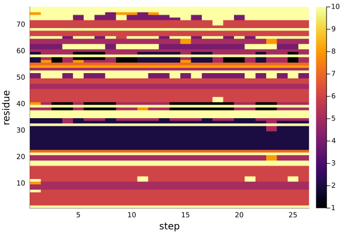

# Stride.jl

This package parses the [Stride](https://en.wikipedia.org/wiki/STRIDE_(algorithm)) secondary structure prediction output, to make it convenient to use from Julia, and for the analysis of MD simulations. 

1. [Installation](#installation)
2. [Usage](#usage)

   - [Computing from a PDB file](#computing-the-secondary-structure-from-a-pdb-file)
   - [Computing from a PDBTools selection](#computing-from-a-selection-of-atoms-using-pdbtools)
   - [Interpretation of the output](#interpretation-of-the-output)
   - [Computing the secondary structure in a MD trajectory](#computing-the-secondary-structure-in-a-trajectory)
   - [Computing the secondary structure map along the trajectory](#computing-the-secondary-structure-map)


3. [References](#references)

## Installation

Obtain `stride` from the corresponding repository, compile it and add it to your path:

```bash
git clone https://github.com/MDAnalysis/stride
cd stride/src
make
cp ./stride /usr/local/bin # or somewhere in the path
```

In Julia, install `Stride` with:

```julia
import Pkg; Pkg.add("https://github.com/m3g/Stride.jl")
```

## Usage

### Computing the secondary structure from a PDB file

```julia
julia> using Stride

julia> pdbfile = "pdb1fmc.pdb"

julia> ss = secondary_structure(pdbfile)
510-element Vector{Stride.SSData}:
 SSData("MET", "A", 1, 1, "C", 360.0, 150.62, 234.4)
 SSData("PHE", "A", 2, 2, "C", -69.01, 138.78, 162.9)
 
 SSData("ASN", "B", 255, 255, "C", -130.75, 360.0, 114.8)
```

### Computing from a selection of atoms using PDBTools

Install `PDBTools` with:
```julia
import Pkg; Pkg.add("PDBTools")
```

Then:

```julia
julia> using Stride, PDBTools

julia> pdbfile = "pdb1fmc.pdb"

julia> pdb = readPDB(pdbfile, "protein and chain A") # read only protein atoms from chain A
   Array{Atoms,1} with 1876 atoms with fields:
   index name resname chain   resnum  residue        x        y        z occup  beta model segname index_pdb
       1    N     MET     A        1        1   22.518   17.379   31.003  1.00 34.99     1       -         1
       2   CA     MET     A        1        1   23.426   17.764   32.113  1.00 34.03     1       -         2
                                                       ⋮ 
    1876  OXT     ASN     A      255      255   44.876   38.278   -2.437  1.00 54.24     1       -      1876

julia> ss = secondary_structure(pdb)
255-element Vector{SSData}:
 SSData("MET", "A", 1, 1, "C", 360.0, 150.62, 234.4)
 SSData("PHE", "A", 2, 2, "C", -69.01, 138.78, 162.9)
 ⋮
 SSData("ASN", "A", 255, 255, "C", -130.97, 360.0, 100.9)
```

## Interpretation of the output

The output is a vector of `SSData` elements, with the following data, for each residue:

```julia
struct SSData
    resname::String
    chain::String
    residue::Int
    resnum::Int
    sscode::String
    phi::Float64
    psi::Float64
    area::Float64
end
```

### Classes of secondary structure

The classes of secondary structure and their codes are:

| Secondary structure | `sscode`     | `ssenum`    |
|---------------------|:------------:|:------------:|
| `"310 helix"`       | `"G"`        | `1`          | 
| `"alpha helix"`     | `"H"`        | `2`          |
| `"pi helix"`        | `"I"`        | `3`          |
| `"turn"`            | `"T"`        | `4`          |
| `"beta strand"`     | `"E"`        | `5`          |
| `"beta bridge"`     | `"B"`        | `6`          |
| `"bend"`            | `"S"`        | `7`          |
| `"coil"`            | `"C"`        | `8`          |

See the [DSSP secondary structure classification](https://en.wikipedia.org/wiki/Protein_secondary_structure) for further information.

### Secondary structure composition

It is possible to extract the composition of the secondary structure with:

```julia
julia> c = ss_composition(ss)
Dict{String, Int64} with 10 entries:
  "3₁₀ helix"   => 11
  "bend"        => 0
  "turn"        => 34
  "helix"       => 132
  "beta strand" => 39
  "alpha helix" => 121
  "pi helix"    => 0
  "beta bridge" => 2
  "strand"      => 41
  "coil"        => 48

julia> c["alpha helix"]
121
```

The class of secondary structure of each residue can be retrived with the `class` function:

```julia
julia> ss[10]
SSData("ASP", "A", 10, 10, "T", -53.61, 124.03, 78.7)

julia> class(ss[10])
"turn"
```

And helper functions are available to obtain boolean vectors to check if each residue belong to some class. For example:

```julia
julia> is_helix(ss[10])
false

julia> is_helix.(ss)
255-element BitVector:
 0
 0
 0
 1
 ⋮
 0
 0
 0
```

where in the last example we used the broadcast operation (the dot) to obtain the result of the application of the function for the complete array of residues.

The following functions are available:
```julia
is_helix
is_alphahelix
is_pihelix
is_310helix
is_strand
is_betastrand
is_betabridge
is_turn
is_bend
is_coil
```

### Computing the secondary structure in a trajectory 

```julia
using Stride
import PDBTools
import Chemfiles

atoms = PDBTools.readPDB("system.pdb", "protein and chain A")
trajectory = Chemfiles.Trajectory("./trajectory.xtc")

helical_content = ss_content(is_helix, atoms, trajectory)
```

### Computing the secondary structure map

```julia
using Stride
import PDBTools
import Chemfiles

atoms = PDBTools.readPDB("system.pdb", "protein and chain A")
trajectory = Chemfiles.Trajectory("./trajectory.xtc")

ssmap = ss_map(atoms, trajectory) # returns a matrix
```

This will create a matrix that can be visualized, for instance, with:

```julia
using Plots
heatmap(ssmap,xlabel="step",ylabel="residue")
```

producing the figure:



where the colors refer to the `ssenum` fields of the [classes table](#classes-of-secondary-structure) above.

## Note

This is a package under early development. New functionality and breaking changes may occur. 

## References

This package is wrapper for the `stride` algorithm for secondary structure prediction. If this was useful, please cite:

- Frishman,D & Argos,P. (1995) Knowledge-based secondary structure assignment. Proteins: structure, function and genetics, 23, 566-579.
- Kabsch,W. & Sander,C. (1983) Dictionary of protein secondary structure: pattern recognition of hydrogen-bonded and geometrical features. Biopolymers, 22: 2577-2637.


