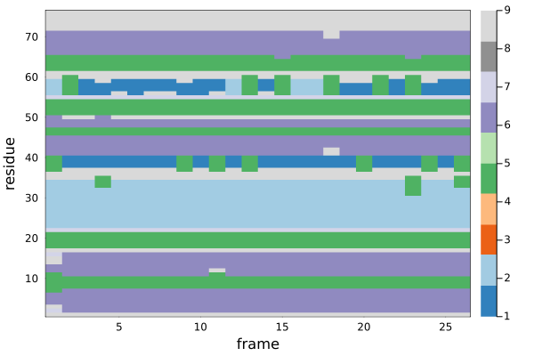
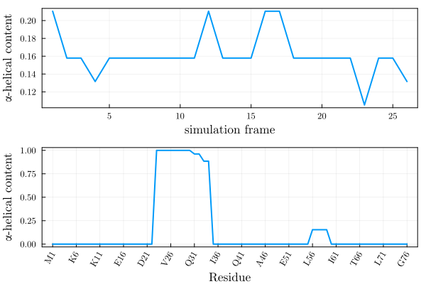

# Molecular Dynamics Trajectories

This package provides convenience functions to analyze the secondary structure along
molecular dynamics simulations. The user must provide a `PDB` file of the system 
simulated and a trajectory file, which may be of one of the most common formats,
as supported by [Chemfiles](https://chemfiles.org/). 

## Secondary structure map

The secondary structure map is the profile of the secondary structure computed for 
each frame of the trajectory. This computation may be costly, particularly with the 
DSSP algorithm, so it is recommeded to save the result. See [Saving and loading a map](@ref)
for further information. 

A complete example for computing a secondary structure map is shown below:

```julia
using ProteinSecondaryStructures 
using PDBTools: readPDB 
using Chemfiles: Trajectory

pdbfile = ProteinSecondaryStructures.Testing.data_dir*"/Gromacs/system.pdb"
trajectory_file = ProteinSecondaryStructures.Testing.data_dir*"/Gromacs/trajectory.xtc"

atoms = readPDB(pdbfile, "protein")
trajectory = Trajectory(trajectory_file)

ssmap = ss_map(atoms, trajectory) # returns a Matrix{Int}
```

In the example, we loaded a Gromacs `xtc` trajectory. 
The method used to compute the secondary structure can be selected with the `method` keyword
parameter, which defaults to `stride`:

```julia
ssmap = ss_map(atoms, trajectory; method=stride_run)
ssmap = ss_map(atoms, trajectory; method=dssp_run)
```

!!! note
    Importantly, note that we have selected the `"protein"` atoms when reading the PDB 
    file of the trajectory. This is important, both to avoid unnecessary reading and 
    writting of coordiantes which are of no interest, and to guarantee that the 
    algorithm for computing secondary structure will not fail.

This will create a matrix that can be visualized, for instance, with:

```julia
using Plots
heatmap(ssmap,
  xlabel="frame",
  ylabel="residue",
  framestyle=:box,
  color=palette(:tab20c,10)
)
```

producing the figure:



where the colors refer to the `code number` fields of the [Secondary structure classes](@ref) table.

## Saving and loading a map

The secondary structure map computed is just a matrix of integer codes. Thus, it can be saved or read in any preferred format.
As a suggestion, it is possible to use `writedlm` and `readdlm` function from the `DelimitedFiles` package: 

```julia
using DelimitedFiles
# save data to ssmap.dat
writedlm("ssmap.dat", ssmap)
# load data
ssmat = readdlm("ssmap.dat", Int)
```

## Secondary structure classes

From a precomputed secondary structure map, or from a trajectory, helper functions
will provide the content of a specific call of secondary structure along the simulation:

### From the secondary structure map

Calling `ss_content` with a class identifier function and a map (as computed above), will return the content
of that class along the trajectory:

```julia-repl
julia> ss_content(is_alphahelix, ssmap)
26-element Vector{Float64}:
 0.21052631578947367
 0.15789473684210525
 ⋮
 0.13157894736842105
```

The composition of classes for a given frame can also be retrieved from the content map:

```julia
julia> ss_composition(ssmap, 6)
Dict{String, Int64} with 10 entries:
  "310 helix"   => 7
  "bend"        => 0
  "turn"        => 17
  "kappa helix" => 0
  "beta strand" => 25
  "beta bridge" => 2
  "alpha helix" => 12
  "pi helix"    => 0
  "loop"        => 0
  "coil"        => 13
```

These functions are useful, because the computation of the secondary structure along the
trajectory (the map) can be costly.

### Single class, througout the trajectory

If the user wants to compute the content of a single class of secondary structures
along a trajectory, that can be done without precomputing the secondary structure map.
(note, however, that the cost is similar).

For example, in the following script we compute the content of $\alpha$-helices of the
structure along the trajectory:

```julia
using ProteinSecondaryStructures 
using PDBTools: readPDB 
using Chemfiles: Trajectory

pdbfile = ProteinSecondaryStructures.Testing.data_dir*"/Gromacs/system.pdb"
trajectory_file = ProteinSecondaryStructures.Testing.data_dir*"/Gromacs/trajectory.xtc"

atoms = readPDB(pdbfile, "protein")
trajectory = Trajectory(trajectory_file)

helical_content = ss_content(is_alphahelix, atoms, trajectory)
```

The method to compute the secondary structure can be defined again with the `method`
keyword: 

```julia
helical_content = ss_content(is_alphahelix, atoms, trajectory; method=stride_run)
#or
helical_content = ss_content(is_alphahelix, atoms, trajectory; method=dssp_run)
```

## Average structure per residue

Here we provide a example where we use some features of `PDBTools.jl` and `Plots`
to illustrate the average content of $\alpha$-helices for each residue
of the protein, along the simulation. 

Here, we assume that a secondary structure map, `ssmap`, was computed using the
instructions above.

The goal is to obtain a figure similar to this one, in which in the upper pannel we
show the evolution of the total $\alpha$-helical content as a function of the simulation
frames, and in the lower pannel we show the content of helices of each residue, with
appropriate indexing. 



The script to produce the figure above is a manipulation of the `ssmap` output, using
function from `PDBTools` and the plotting features of `Plots`. THe complete script is:

```julia
using Plots, PDBTools
Plots.default(fontfamily="Computer Modern",linewidth=1,framestyle=:box)
plt = plot(layout=(2,1))
ahelix = ss_content(is_alphahelix, ssmap)
plot!(plt, subplot=1, 
    ahelix, label=nothing, linewidth=2,
    xlabel="simulation frame", 
    ylabel="α-helical content"
 )
residue_indexes=1:length(eachresidue(atoms))
one_letter_names = eachresidue(atoms) .|> resname .|> oneletter;
string_numbers = eachresidue(atoms) .|> resnum .|> string;
xlabels = one_letter_names .* string_numbers
ahelix_avg = map(mean, eachrow(is_alphahelix.(ssmap)))
xticks=(residue_indexes[begin:5:end],xlabels[begin:5:end])
plot!(plt, subplot=2,
    residue_indexes, 
    ahelix_avg, 
    label=nothing, linewidth=2, 
    xlabel="Residue",
    ylabel="α-helical content",
    xticks=xticks, xrotation=60
)
savefig("./helical_content.svg")
```

#### Step-by-step construction of the figure

First, we load the `Plots` and `PDBTools` packages, and set some default
parameters for `Plots` for prettier output.

```julia-repl
julia> using Plots, PDBTools

julia> Plots.default(fontfamily="Computer Modern",linewidth=1,framestyle=:box)
```

We then initialize a plot with two pannels. The upper supblot will contain the
$\alpha$-helical content as a function simulation frames, and the lower subplot
will contain the average content of helices for each residue.

```julia-repl
julia> plt = plot(layout=(2,1))
```

Next, we compute, from the secondary structure map, the $\alpha$-helical content,
for each frame of the trajectory, which will be printed in the first subplot of the figure:

```julia-repl
julia> ahelix = ss_content(is_alphahelix, ssmap)

julia> plot!(plt, subplot=1, 
           ahelix, label=nothing, 
           xlabel="simulation frame", 
           ylabel="α-helical content"
        )
```

For the second plot, we first define a residue range, with the number of residues of
the protein, using [`PDBTools.eachresidue`](https://m3g.github.io/PDBTools.jl/stable/selections/#Iterate-over-residues-(or-molecules)) iterator.
Here, `length(eachresidue(atoms))` is just the number of residues of the protein:

```julia-repl
julia> residue_indexes=1:length(eachresidue(atoms))
1:76
```

We the extract the names of all residues, which we will use for creating the `x`-labels of our plot. We
iterate over all residues first to extract their names, which are converted to *one-letter* codes, and these
are concateneted (with the `*` operation on strings), with the residue numbers converted to strings: 

```julia-repl
julia> one_letter_names = eachresidue(atoms) .|> resname .|> oneletter;

julia> string_numbers = eachresidue(atoms) .|> resnum .|> string;

julia> xlabels = one_letter_names .* string_numbers
76-element Vector{String}:
 "M1"
 "Q2"
 ⋮
 "G76"
```

The `y`-axis of our plot will contain the average $\alpha$-helical content for each residue.
To extract that, we will first convert the `ssmap` to matrix of `0`s and `1`s, with the
broadcast of the `is_alphahelix` function:

```julia-repl
julia> is_alphahelix.(ssmap)
76×26 BitMatrix:
 0  0  0  0  0  0  0  0  0  0  0  0  0  0  0  0  0  0  0  0  0  0  0  0  0  0
 0  0  0  0  0  0  0  0  0  0  0  0  0  0  0  0  0  0  0  0  0  0  0  0  0  0
 ⋮              ⋮              ⋮              ⋮              ⋮              ⋮
 0  0  0  0  0  0  0  0  0  0  0  0  0  0  0  0  0  0  0  0  0  0  0  0  0  0
```

The average of each row is the the average content of helices for each residue:
```julia-repl
julia> ahelix_avg = map(mean, eachrow(is_alphahelix.(ssmap)))
76-element Vector{Float64}:
 0.0
 0.0
 ⋮
 0.0
```

We can finally plot the second supblot of our figure, with the note that we have filtered
some `x`-tick labels to avoid having a crowded axis:

```julia-repl
julia> plot!(plt, subplot=2,
           residue_indexes, 
           ahelix_avg, 
           label=nothing,
           xlabel="Residue",
           ylabel="α-helical content",
           xticks=(residue_indexes[begin:5:end], xlabels[begin:5:end]),
           xrotation=60, linewidth=2,
       )

julia> savefig("./helical_content.svg")
```

The final line saves the figure to an external file.


